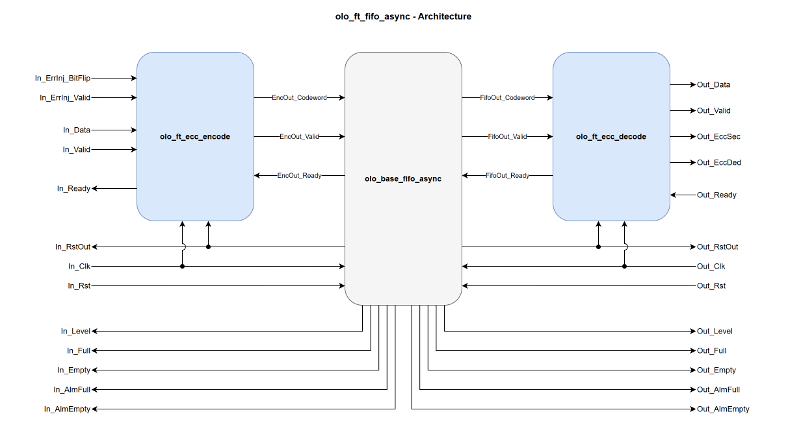

# olo_ft_fifo_async

[Back to **Entity List**](../EntityList.md)

## Status Information

VHDL Source: [olo_ft_fifo_async](../../src/ft/vhdl/olo_ft_fifo_async.vhd)

## Description

This component implements an **ECC-protected asynchronous FIFO** using SECDED (Single Error Correction, Double Error
Detection) Hamming code. The interface and behavior match [olo_base_fifo_async](../base/olo_base_fifo_async.md).

The ECC is transparent to the user: data is automatically encoded on write and decoded/corrected on read. Error status
flags indicate whether a single-bit error was corrected or a double-bit error was detected.

## Generics

| Name            | Type      | Default | Description                                                  |
| :-------------- | :-------- | ------- | :----------------------------------------------------------- |
| Width_g         | positive  | -       | Number of data bits per FIFO entry. The internal FIFO is wider to accommodate ECC parity bits. |
| Depth_g         | positive  | -       | Number of FIFO entries.  This **must** be a power of two (see [olo_base_fifo_async](../base/olo_base_fifo_async.md)). |
| AlmFullOn_g     | boolean   | false   | Enable almost-full flag                                      |
| AlmFullLevel_g  | natural   | 0       | Almost-full threshold level                                  |
| AlmEmptyOn_g    | boolean   | false   | Enable almost-empty flag                                     |
| AlmEmptyLevel_g | natural   | 0       | Almost-empty threshold level                                 |
| RamStyle_g      | string    | "auto"  | Controls the RAM implementation resource                     |
| RamBehavior_g   | string    | "RBW"   | Controls the RAM behavior. "RBW" or "WBR"                    |
| ReadyRstState_g | std_logic | '1'     | Value of _In_Ready_ during reset. Behaves exactly as in [olo_base_fifo_async](../base/olo_base_fifo_async.md). |
| Optimization_g  | string    | "SPEED" | "SPEED" or "LATENCY". Behaves exactly as in [olo_base_fifo_async](../base/olo_base_fifo_async.md). |
| SyncStages_g    | positive  | 2       | Number of synchronization stages of the clock crossings.  Range: 2 ... 4 |

## Interfaces

### Input Data

| Name      | In/Out | Length    | Default | Description                                                  |
| :-------- | :----- | :-------- | ------- | :----------------------------------------------------------- |
| In_Clk    | in     | 1         | -       | Input clock                                                  |
| In_Rst    | in     | 1         | -       | Reset input (high-active, synchronous to _In_Clk_). Empties the FIFO and clears the internal error-injection latch. |
| In_RstOut | out    | 1         | N/A     | Reset output (see [clock-crossing principles](../base/clock_crossing_principles.md), synchronous to _In_Clk_) |
| In_Data   | in     | _Width_g_ | -       | Input data (synchronous to _In_Clk_)                         |
| In_Valid  | in     | 1         | '1'     | AXI4-Stream handshaking signal for _In_Data_ (synchronous to _In_Clk_) |
| In_Ready  | out    | 1         | N/A     | AXI4-Stream handshaking signal for _In_Data_ (synchronous to _In_Clk_) |

### Output Data

| Name       | In/Out | Length    | Default | Description                                                  |
| :--------- | :----- | :-------- | ------- | :----------------------------------------------------------- |
| Out_Clk    | in     | 1         | -       | Output clock                                                 |
| Out_Rst    | in     | 1         | -       | Reset input (high-active, synchronous to _Out_Clk_). Empties the FIFO and clears the internal error-injection latch. |
| Out_RstOut | out    | 1         | N/A     | Reset output (see [clock-crossing principles](../base/clock_crossing_principles.md), synchronous to _Out_Clk_) |
| Out_Data   | out    | _Width_g_ | N/A     | Output data, corrected if a single-bit error was detected (synchronous to _Out_Clk_) |
| Out_Valid  | out    | 1         | N/A     | AXI4-Stream handshaking signal for _Out_Data_ (synchronous to _Out_Clk_) |
| Out_Ready  | in     | 1         | '1'     | AXI4-Stream handshaking signal for _Out_Data_ (synchronous to _Out_Clk_) |
| Out_EccSec | out    | 1         | N/A     | Single error corrected flag. Time-aligned with _Out_Data_.   |
| Out_EccDed | out    | 1         | N/A     | Double error detected flag. Read data is unreliable. Time-aligned with _Out_Data_. |

### Input Status

| Name        | In/Out | Length                  | Default | Description                                                  |
| :---------- | :----- | :---------------------- | ------- | :----------------------------------------------------------- |
| In_Full     | out    | 1                       | N/A     | Status flag. Asserted if the FIFO is full (synchronous to _In_Clk_) |
| In_Empty    | out    | 1                       | N/A     | Status flag. Asserted if the FIFO is empty (synchronous to _In_Clk_) |
| In_AlmFull  | out    | 1                       | N/A     | Status flag. Asserted if the FIFO fill level is >= _AlmFullLevel_g_ (synchronous to _In_Clk_) Output is undefined if _AlmFullOn_g_=false. |
| In_AlmEmpty | out    | 1                       | N/A     | Status flag. Asserted if the FIFO fill level is <= _AlmEmptyLevel_g_ (synchronous to _In_Clk_) Output is undefined if _AlmEmptyOn_g_=false. |
| In_Level    | out    | ceil(log2(_Depth_g_+1)) | N/A     | FIFO fill level calculated on the write side (synchronous to _In_Clk_) |

### Output Status

| Name         | In/Out | Length                  | Default | Description                                                  |
| :----------- | :----- | :---------------------- | ------- | :----------------------------------------------------------- |
| Out_Full     | out    | 1                       | N/A     | Status flag. Asserted if the FIFO is full (synchronous to _Out_Clk_) |
| Out_Empty    | out    | 1                       | N/A     | Status flag. Asserted if the FIFO is empty (synchronous to _Out_Clk_) |
| Out_AlmFull  | out    | 1                       | N/A     | Status flag. Asserted if the FIFO fill level is >= _AlmFullLevel_g_ (synchronous to _Out_Clk_) Output is undefined if _AlmFullOn_g_=false. |
| Out_AlmEmpty | out    | 1                       | N/A     | Status flag. Asserted if the FIFO fill level is <= _AlmEmptyLevel_g_ (synchronous to _Out_Clk_) Output is undefined if _AlmEmptyOn_g_=false. |
| Out_Level    | out    | ceil(log2(_Depth_g_+1)) | N/A     | FIFO fill level calculated on the read side (synchronous to _Out_Clk_) |

### Error Injection (optional)

These ports drive the internal [olo_ft_ecc_encode](./olo_ft_ecc_encode.md) instance (synchronous to _In_Clk_). Leave
them unconnected for normal operation; see
[Open Logic Fault-Tolerance Principles - Error Injection](./olo_ft_principles.md#error-injection) for the
latched-strobe semantics shared across the _ft_ area.

| Name              | In/Out | Length                                                               | Default | Description                                                  |
| :---------------- | :----- | :------------------------------------------------------------------- | ------- | :----------------------------------------------------------- |
| In_ErrInj_BitFlip | in     | _[eccCodewordWidth](./olo_ft_pkg_ecc.md#ecccodewordwidth)(Width_g)_  | all 0   | Codeword-wide flip pattern. Each '1' bit XORs (flips) the corresponding bit of the stored codeword. Popcount 1 = SEC-correctable, popcount 2 = DED-detectable. |
| In_ErrInj_Valid   | in     | 1                                                                    | '0'     | Strobe that latches _In_ErrInj\_BitFlip_ into the encoder's pending-injection register. The latched pattern is applied to the next accepted input beat. |

## Detailed Description

### Architecture

The entity is composed of three Open Logic entities:

1. [olo_ft_ecc_encode](./olo_ft_ecc_encode.md) encodes each accepted input beat into a SECDED codeword (_In_Clk_
   domain, reset by _In_RstOut_).
2. [olo_base_fifo_async](../base/olo_base_fifo_async.md) stores the codeword (entity configured with a
   codeword-wide word) and crosses the clock domains. All levels, status flags and reset outputs come directly
   from it.
3. [olo_ft_ecc_decode](./olo_ft_ecc_decode.md) decodes and corrects each beat on the read side (_Out_Clk_ domain,
   reset by _Out_RstOut_) and drives _Out_EccSec_ / _Out_EccDed_ time-aligned with _Out_Data_.

The codeword is protected end-to-end while it is inside the FIFO: encoding happens before, and decoding after,
all storage elements.

See [olo_base_fifo_async](../base/olo_base_fifo_async.md) for detailed FIFO behavior.

Note that the ECC FIFOs deliberately come **without a scrubber**, unlike the ECC RAMs
([olo_ft_ram_sp_scrub](./olo_ft_ram_sp_scrub.md), [olo_ft_ram_sdp_scrub](./olo_ft_ram_sdp_scrub.md)).
A FIFO does not store data permanently, so as long as it is drained regularly, errors do not accumulate
in a word over time and there is nothing for a background scrubber to repair.

### Combinational ECC Encoder and Decoder

Both codecs are instantiated with `Pipeline_g = 0`. The datapath to and from the internal FIFO is
therefore combinational, and the _ft_ entity behaves exactly like its
[olo_base_fifo_async](../base/olo_base_fifo_async.md) counterpart.

The ECC decode lies between the RAM output and the output ports and is the critical path of the entity.
Where it limits the clock frequency, use
[olo_base_fifo_async](../base/olo_base_fifo_async.md) directly and place registered
[olo_ft_ecc_encode](./olo_ft_ecc_encode.md) / [olo_ft_ecc_decode](./olo_ft_ecc_decode.md) instances
around it in the surrounding design. The levels and status flags of the base FIFO then do not account for
the beats held in the codec pipelines.

### Radiation Hardening

The ECC protects the data stored in the FIFO. The control logic (pointers, level and flag computation, handshaking)
is protected by the automatic TMR of the surrounding design (e.g. `syn_radhardlevel = "tmr"` in Synplify for
Microchip devices), like any other logic.

The synchronizers of the Gray-pointer and reset clock crossings are excluded from automatic TMR, see
[clock-crossing principles](../base/clock_crossing_principles.md#radiation-hardening). A single-event upset of a
pointer synchronizer register therefore shows a wrong pointer value on the other side of the FIFO for one clock
cycle. Because of the Gray-to-binary conversion, the wrong value can differ from the correct one by more than one
entry. If the other side reads or writes in exactly this cycle, it can read entries that were not written yet or
overwrite entries that were not read yet, and the FIFO state stays wrong until the next reset. An upset of a reset
synchronizer register leads to a spurious reset of both sides. Take this into account in the radiation analysis
of the design.

### ECC Overhead, Error Injection and Status Flags

See the corresponding sections in
[Open Logic Fault-Tolerance Principles](./olo_ft_principles.md):

- [ECC Overhead](./olo_ft_principles.md#ecc-overhead) - internal storage width vs. data width
- [Error Injection](./olo_ft_principles.md#error-injection) - semantics of _In_ErrInj\_BitFlip_ / _In_ErrInj\_Valid_
- [Error Status Flags](./olo_ft_principles.md#error-status-flags) - meaning of _Out_EccSec_ / _Out_EccDed_

### Constraints

The same constraints as for [olo_base_fifo_async](../base/olo_base_fifo_async.md) apply, see
[clock-crossing principles](../base/clock_crossing_principles.md). Because the clock crossings are the ones of
_olo_base_fifo_async_, the automatic constraints for _AMD_ tools (_Vivado_) apply as well.

See
[Open Logic Fault-Tolerance Principles - Constraints That Apply Across the Area](./olo_ft_principles.md#constraints-that-apply-across-the-area)
for the constraints that apply across the _ft_ area.
